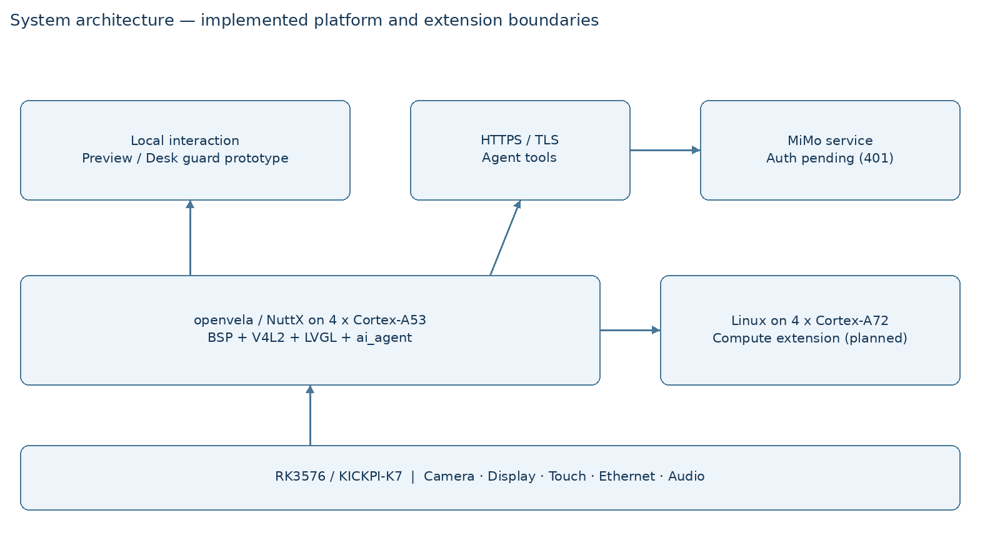
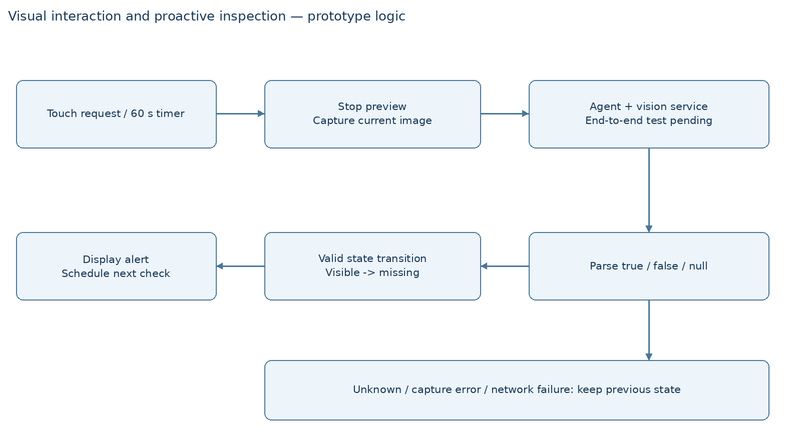

# VelaPort-K7：基于 RK3576 的 openvela 平台适配与桌面视觉助手

2026 首届 openvela AI 硬件开发者大赛 · 技术报告

版本：V0.2｜日期：2026-09-20｜主要赛道：新硬件平台适配

编写范围：依据赛事作品提交模板第二节撰写。代码基线为专属仓库 `dev-ai-contest-2026` 分支的 14f359a（与开发分支 rk3576-bsp 同一提交）。量化结果分别标明原始记录、提交说明或历史摘要来源；未完成实测的指标不填估计值。

V0.2 相对 V0.1（2026-09-17）的变化：云端推理与语音闭环已打通并留有实测；启动时间二次优化；xTS 按原文口径完成复测，缺口从 16 项收敛到 4 项，并逐项给出未达成的原因。

## 1、信息表

| 项目 | 内容 |
| --- | --- |
| 作品名称 | VelaPort-K7：基于 RK3576 的 openvela 平台适配与桌面视觉助手（暂定） |
| 队伍名称 | 南山南（根据仓库名称暂定，待团队确认） |
| 团队分工 | 成员姓名及正式分工待补；工作范围包括 BSP、驱动、AMP、图形与 Agent 应用、测试与文档 |
| 选题方向 | 新硬件平台适配；桌面视觉助手作为平台能力展示应用 |
| 硬件平台 | KICKPI-K7，Rockchip RK3576，4×Cortex-A53 + 4×Cortex-A72 |
| 系统方案 | openvela/NuttX 运行于 A53 簇；Linux 运行于 A72 簇；AMP 协同 |
| 专属仓库 | https://github.com/open-vela/contest2026_423_nanshannan |
| 开发仓库 | https://github.com/zhouyllll/contest2026_423_nanshannan |
| 报告状态 | V0.2；严格 xTS 复测已完成并留原始日志，仍待补成员分工、实物照片与演示视频 |

## 2、摘要

本作品面向带屏视觉终端，将 openvela 适配至 KICKPI-K7（RK3576），构建 A53 四核运行 openvela、A72 四核运行 Linux 的 AMP 系统。实现启动、中断与外设适配，接入 LVGL、IMX415 相机、音频与 ai_agent，形成可用的桌面视觉助手：说出唤醒词后，设备完成识别、拍照、视觉问答与语音播报的完整链路，其中语音端点检测由 A72 的 Linux 承担、openvela 负责外设与交互。关键工作包括共享 GIC 资源划分、DMA 缓冲管理及烧写布局校验。

实测结果：网络 100/100 包成功、平均时延 0.85 ms；相机预览约 30 fps；从 `reboot` 到 NuttShell 平均 2.76 s、冷启动平均 2.84 s（各 10 次）；12 小时待机（KASAN 镜像）无重启、无异常、堆无泄漏。xTS 通用自测 35 项中 31 项通过，其中 13 项按原文口径复测并保留原始日志；未达成的 4 项各自给出了原因，不做推测性判定。

## 3、正文

### 3.1 绪论

#### 3.1.1 项目背景与问题定义

带屏桌面终端需要同时完成触摸交互、摄像头采集、网络通信和智能问答。对使用者而言，目标是通过屏幕或自然语言查看桌面、检查钥匙和水杯等物品，并在开启巡检后获得状态变化提醒。对开发者而言，首先必须让操作系统可靠访问硬件，并保证显示、相机和通信同时工作时仍能响应用户。

本项目以新硬件平台适配为核心。项目保存的赛道材料将 KICKPI-K7 列为待适配目标，工程从芯片启动和板级支持向上接入 openvela 图形、多媒体及 AI 组件。报告不将上层应用规划等同于已验收的产品功能。

#### 3.1.2 关键技术挑战

第一，不能直接沿用其他 Rockchip 芯片参数。RK3576 使用 GICv2，DRAM 起点和外设地址布局需要逐项核对。启动、异常级切换、MMU、PSCI 和中断路由任一环节错误，都可能表现为串口无输出。

第二，AMP 两侧共享 DDR、GIC、时钟及电源资源。若 Linux 初始化了属于 openvela 的中断或外设，即使各侧代码单独运行正常，双系统也会失效。资源归属必须同时落实在 DTS、Kconfig、引导和驱动中。

第三，相机与网络均通过 DMA 工作，缓冲区所有权、缓存维护、描述符回收和错误回滚会直接影响系统稳定性。图形刷新还要与采集线程共享 CPU，功能正确不等于交互流畅。

第四，验证通道本身必须可信。高速串口漏字、开发机与板端 IP 混淆、WSL 墙钟回跳以及镜像分区互相覆盖，都曾影响判断。因此将版本、配置、镜像哈希和原始记录绑定，是项目验收的一部分。

#### 3.1.3 创新点与边界

本作品的主要特点是将平台适配与实际多媒体应用串联：openvela 负责外设和交互，Linux 作为可扩展计算域；以资源归属约定处理共享 GIC 的协同启动；通过相机页面与桌面助手检验驱动到应用的完整调用链。项目进一步沉淀硬件参数核对、时钟排查和有界调试 Skill，降低类似适配工作的重复排错成本。

语音链路已完成端到端验证：唤醒词识别、拍照、视觉问答与语音播报在板上串起来，其中端点检测放在 A72 的 Linux 上执行，形成了 AMP 下的实际分工而非演示性占位。Linux NPU/ISP 加速仍属后续方向，没有完成跨系统推理链路验收；主动巡检的状态机有原型逻辑，但连续多帧确认与误报率未做统计。

### 3.2 系统方案设计

#### 3.2.1 总体架构

系统分为硬件适配、openvela 服务、应用交互和可选计算扩展四层。触摸与相机数据首先进入 openvela，LVGL 展示设备状态及实时图像；用户提出视觉问题后，应用通过 ai_agent 客户端发起请求，由相机工具获取当前图像并调用云端模型。AMP 通道为 Linux 计算扩展预留数据交换能力。

| 层级 | 组成 | 职责与当前边界 |
| --- | --- | --- |
| 引导与芯片层 | U-Boot FIT、PSCI、MMU、GICv2、Generic Timer | 分核启动、异常与中断管理、系统时基 |
| 板级外设层 | GMAC、存储、I2C/SPI/GPIO、VOP2/DSI、IMX415/CSI/CIF、SAI/ES8388 | 提供网络、显示、采集及基础外设接口 |
| openvela 组件层 | NuttX、LVGL、V4L2、ai_agent、rpmsg/rptun | 调度、界面、视频访问、Agent 工具与核间通信 |
| 应用层 | kickpi_ui、cam/v4l2cap、ampctl、k7diag、桌面巡检原型 | 触摸演示、诊断和场景交互 |
| 外部服务 | MiMo 兼容接口（文本/视觉/ASR/TTS）；Linux 计算域 | 云端推理已闭环；Linux 侧已承担端点检测，NPU/ISP 未验收 |

#### 3.2.2 方案论证与选型

| 方案 | 优点 | 代价与选择 |
| --- | --- | --- |
| 纯 openvela | 资源归属简单、便于定位 BSP 问题 | 厂商 NPU/ISP 软件栈接入成本高；保留为单系统对照方案 |
| openvela + Linux AMP | openvela 负责交互和外设，同时保留 Linux 厂商生态扩展空间 | 需要严格约束共享资源；作为主方案 |
| 纯 Linux 应用 | 多媒体生态成熟 | 不能体现本作品的 openvela 新平台适配目标，未采用 |

选择 KICKPI-K7 是因为其异构 CPU、显示及摄像头接口能够支撑从 BSP 到交互应用的综合验证，并有原厂 SDK、设备树和硬件资料可作为参数交叉核对依据。原厂代码用于核对时钟、引脚和协议行为，工程实现仍需匹配 NuttX 驱动接口。

端侧负责采集、预览、状态管理和工具执行，云端负责语言与视觉推理。断网或鉴权失败时保留本地显示及相机预览，界面报告失败或超时；巡检对未知结果不更新物品状态。当前没有离线视觉模型，不宣称断网后仍能识别物品。

#### 3.2.3 通信与资源协同

openvela 使用 4 个 A53 核，Linux 使用 4 个 A72 核。mailbox 门铃与 rpmsg/virtio 负责协同通信；历史记录包含握手完成及 /dev/rpmsg/linux 出现。共享缓冲区必须约定物理地址、大小和缓存属性，数据写入与通知顺序保持一致。

显示、触摸、网络、相机及其 I2C/MCLK/GPIO 归 openvela。Linux 禁用对应设备节点，避免运行时接管。两侧不可随意修改公共 PLL 或关闭对端使用的电源域。共享 GIC 不构成安全隔离，本方案用于互信的双系统协同。

### 3.3 核心算法与技术原理

#### 3.3.1 图像处理与 AI 调用

IMX415 经 CSI 接收链路和 CIF 将原始图像写入 DDR，板级处理代码提供 Bayer 去马赛克、白平衡、缩放和 JPEG 编码能力，V4L2 通过 /dev/video0 向应用提供访问入口。历史材料记录 1932×1096 采集和 1280×720 JPEG 输出；分辨率与预览帧率来自不同测试，不应组合成未经测量的同一指标。

灰世界白平衡以各通道均值估计增益，例如以绿色通道为参考取 gR=mean(G)/mean(R)、gB=mean(G)/mean(B)，并对输出限幅。该方法计算量低，适合原型图像校正，但在单色场景和特殊照明下有偏差；不等价于完整的 ISP 3A 算法。

AI 部分通过 HTTPS 调用 MiMo 兼容后端（文本/视觉 `mimo-v2.5`、语音合成 `mimo-v2.5-tts`、语音识别 `mimo-v2.5-asr`）。鉴权凭据由本地头文件提供，已 gitignore，不进入报告和公开仓库。

V0.1 记录的 HTTP 401 已解决（凭据配置问题），当前为真实可用：桌面问答（拍照 1280×720 + 一次视觉请求）板上实测 4.5~27 s，随网络波动；语音识别单句约 0.9 s。

★ 桌面问答不走 ai_agent 的工具编排循环，原因是实测而非偏好：走 agent 需要三次模型调用，且该后端默认开启深度思考，板上一次问答实测 196 s；关闭思考（请求体加 `"thinking":{"type":"disabled"}`）降到 23 s，但 agent 自带的相机工具取到 0 字节、并会因会话记忆复用上一次回答。拍照 + 一次视觉请求即可满足场景，链路短且可控。

当前没有提交端侧模型的名称、量化精度、推理耗时或 NPU 利用率实测，因此这些项记为未部署/未测，不使用芯片理论算力代替项目结果。

#### 3.3.2 主动巡检决策机制

原型针对 keys、cup 两个目标，请求模型返回 true、false 或 null。每个目标维护未知、可见、缺失三个状态。首次有效结果建立基线；可见变为缺失时显示提醒；null、解析失败或相机失败保持上一状态。正常巡检完成后间隔 60 秒再次请求，请求未发起时使用短暂延后；开关关闭后停止新的巡检请求。

这些机制已体现在应用代码中，但还缺少连续多帧确认、独立提醒冷却策略、真实置信度校准和迟到回调处理的完整验收。

唤醒与语音闭环已完成：openvela 以 48 kHz 采集、经 31 阶 FIR 降到 16 kHz 存入 12 秒环形缓冲，通过 rpmsg 送往 A72；Linux 侧的 k7d 做端点检测并回发整句区间；openvela 取出该段送云端识别，匹配唤醒词后触发拍照问答并朗读回答。用户实测可唤醒。

需要说明的边界：识别侧会把 openvela 听成“OpenAI / Open Wheel / OPPO VELA / 薇拉”等，匹配规则按“你好 + open/vela/维拉…”兜底，因此说“你好 OpenAI”也会唤醒；唤醒率与误唤醒率没有做统计，不填百分比。

#### 3.3.3 openvela 能力的使用与拓展

| 能力 | 组件及使用方式 | 本项目贡献/限制 |
| --- | --- | --- |
| 图形 | LVGL、Framebuffer、触摸输入 | 板级显示接入、状态页、相机预览与桌面助手页面 |
| 多媒体 | V4L2、CSI/CIF、图像处理、SAI/ES8388 音频 | 相机采集与视频接口适配；音频录放、ALC 与喇叭功放控制已上板可用 |
| AI | HTTPS 客户端、视觉/ASR/TTS 调用、ai_agent | 唤醒→识别→拍照→视觉问答→播报全链路可用；端侧模型与 NPU 未部署 |
| 系统协同 | SMP、rptun/rpmsg、mailbox | 双系统启动与共享资源归属适配；Linux 侧承担语音端点检测，`ampctl exec` 可在 A72 执行命令 |
| 可维护性 | Kconfig、树外芯片/板级目录、补丁与脚本 | 将平台改动和通用上游修复分开，降低后续合入成本 |

### 3.4 系统实现

#### 3.4.1 软件与固件组织

| 路径 | 内容 |
| --- | --- |
| chip/rk3576/ | 芯片层驱动、寄存器定义及构建入口 |
| board/kickpi-k7/ | 板级初始化、引脚与外设配置、nsh/amp/amp-dual 配置 |
| app/kickpi_ui/ | LVGL 界面、相机预览、Agent 客户端及巡检状态 |
| app/cam/、app/v4l2cap/、app/ampctl/、app/k7diag/ | 相机、核间通信及板级诊断程序 |
| amp/ | FIT 描述、Linux DTS/配置、U-Boot 补丁和资源归属说明 |
| bsp/upstream/ | 通用修复补丁，是否已上游合入需另行核对 |
| scripts/、notes/ | 构建/烧录/测试工具、原始记录和严格验收缺口 |

工程通过 setup-workspace.sh 将树外板级和芯片代码接入 openvela 构建树。最终提交需要锁定各仓库 revision，保存 defconfig、生成后的 .config、ELF/FIT 和哈希；仅保存主仓库提交号不能完整复现依赖仓和未提交补丁。

#### 3.4.2 关键流程及修复案例

启动流程为：BootROM/厂商引导 → U-Boot → 读取 Linux、DTB 与 AMP FIT → PSCI 分核 → openvela 初始化 → NSH、LVGL 与应用服务。曾出现旧烧录路径覆盖 Linux 内核、FIT 放置区域被启动流程改写等问题。当前 amp/layout.sh 统一主机布局，FIT 位于 LBA 24576，脚本检查区间边界并执行备份、写入和回读比对。该布局是本开发环境的工程约定，不是通用刷机指令。

网络案例：收包路径生成 ping/ARP 应答时，未检查发送环空位便提交描述符，可能覆盖仍在使用的缓冲；回收计数失配后在网络锁内无限循环。6d76bf8 增加应答提交检查、丢弃计数与有界回收，提交说明记录修复后 100 次 ping 成功及 Telnet NSH 可用。

相机案例：任务上下文中使用忙等等待新帧，使采集线程挤占与 LVGL 共用的 CPU。48876f1 将等待改为可让出 CPU 的休眠，并降低采集线程优先级，提交说明记录 3 秒显示 88 帧。该案例表明应分别测量采集速率、显示速率与调度等待，不能只看传感器帧率。

驱动审查还发现摄像头部分分配失败未清理、视频启动失败未回滚、网口中断状态覆盖、IRQ 启停不对称和首段录音使用诊断 DMA 等问题；相关修复进入代码后仍需对应回归测试。静态审查结论不直接计为实机 PASS。

启动时间案例（2026-09-19/20，为 xTS 2.1.3/2.1.4）：`board_app_initialize()` 运行在
nsh 任务里，它不返回，控制台就不出提示符。串口时间戳显示触摸 0.22 s、TF 卡 0.35 s、
摄像头与 V4L2 0.28 s 串行占用了启动路径，而这三项 nsh 一样都不用；把它们移入后台
线程并保持原有顺序（界面仍在触摸就绪后启动）后，界面出现时刻不变而 nsh 提前。
U-Boot 侧把按键倒计时的每档从 1000 ms 改为 200 ms，保留 Ctrl-C 打断路径。两项合计
使 reboot 从 4.47 s 降至 2.76 s。

验收过程中发现并修复的两处上游缺陷：其一，`sched/task/task_posixspawn.c` 在找不到
程序文件时按 ERROR 记录，而 NSH 对每条命令都先当作程序文件尝试一次，导致**每条
命令都多打一行 `ERROR: exec failed: 2`**，污染所有“日志无异常”类判据；其二，
`libs/libc/stdio/lib_fopen.c` 以 `_POSIX_STREAM_MAX`（POSIX 规定的最低保证值 16）
作为流数上限且不可配置，而 NIST 统计测试需同时打开 32 个日志流，跑到第 6 项即失败。
两者分别归档在 `bsp/upstream/`，可独立提交上游。

#### 3.4.3 硬件适配与关键 BOM

| 项目 | 接口/连接 | 用途与状态 |
| --- | --- | --- |
| KICKPI-K7 / RK3576 | 板载 SoC、DDR、eMMC、以太网 | 主控制平台；容量和实际采购价格待按实物补齐 |
| 显示屏与 FT8756 触摸 | MIPI DSI；触摸 I2C0，地址 0x38 | 720×1280 交互显示，历史验证记录 |
| IMX415 相机 | MIPI CSI；本次启动记录为 I2C8，地址 0x37 | 摄像头探测、采集和 LVGL 预览 |
| ES8388 音频 | I2C3，地址 0x10；SAI1 | 音频输入输出适配；完整语音链待验收 |
| HYM8563 RTC | I2C2，地址 0x51 | 硬件时钟，严格 RTC 用例待重跑 |
| MAE0621A PHY | GMAC / RGMII | 有线网络与 Agent 联网 |
| CH340 串口与 USB 下载线 | UART0 / RockUSB | 开发、恢复及日志采集，AMP 调试配置为 1500000 baud |
| MPU6050（用户已有） | 待确认连接的 I2C 总线与供电 | 计划作为 I2C 实物功能验证，尚未计入严格 xTS |

本项目涉及新平台 BSP 与驱动开发。GPIO 环回历史接线为扩展排针第 5 脚与第 7 脚；SPI 环回为第 10 脚与第 12 脚。正式提交须补实物照片和排针标注，按当前板卡手册确认电平，不能把芯片 GPIO 编号直接当成排针脚号。蓝牙物料识别在历史材料中存在 AP6256 与 SKW6621S 两种描述，最终 BOM 待实物和总线识别统一；目前仅将 SKW6621S SDIO 探测列为开发进展。

#### 3.4.4 交互端与自定义 Skill

LVGL 界面提供 AMP 状态、设备信息、运行曲线、桌面相机及关于/诊断页面。Open camera 进入实时预览，视觉提问先释放预览使用的相机资源，再通过 Agent 的 camera_capture 获取图像。异步结果经状态缓冲交给 UI 线程更新，避免在回调线程直接操作界面对象。

| Skill | 文件 | 触发场景与沉淀内容 |
| --- | --- | --- |
| soc-hw-recon | .claude/skills/soc-hw-recon/SKILL.md | 新芯片适配时，交叉核对地址、中断、CPU 和时钟参数 |
| board-clock-bringup | .claude/skills/board-clock-bringup/SKILL.md | 外设无信号或时序异常时，逐层检查门控、分频及功能时钟 |
| bounded-bringup | .claude/skills/bounded-bringup/SKILL.md | bring-up 无响应时，限定等待时间并验证观测通道 |
| driver-workflow 入口 | .agents/skills/driver-workflow/SKILL.md | 接入已有驱动开发与审查流程，区分审查发现和实机确认 |
| desk-guard | agent_skills/desk-guard.md | 定义桌面物品检查和未知结果处理；运行时部署与触发待验收 |

开发 Skill 与运行时 Skill 的用途不同。前三项用于 AI 辅助工程开发；desk-guard 用于应用行为约束。运行时部署目录应以实际 ai_agent 的 AGENT_SKILLS_DIR 配置为准，模板要求的 /data/agent/skills/ 与旧项目文档路径需在最终镜像中统一，当前不声称已部署生效。

### 3.5 系统测试与结果分析

#### 3.5.1 测试环境与证据口径

开发环境为 Windows + WSL Ubuntu，USB 经 usbipd 接入，使用 AArch64 交叉工具链、串口及 RockUSB 完成编译下载和采集。测试以实际镜像配置为准。最新网络提交记录使用板端 192.168.1.50，开发机占用 192.168.1.100；报告不把对开发机的 ping 当作板端测试。

证据分为三类：A 为仓内原始记录可直接核对；B 为提交说明中记载的实测结果，需补齐原始文件；C 为历史文档摘要或静态代码，不能代替当前版本回归。不同版本的数据不得合并为同一最终镜像的全部性能。

#### 3.5.2 功能与性能结果

证据等级沿用 3.5.1 的定义。A 类为仓内可直接核对的原始记录（`notes/xts-rerun-raw/` 下按日期与用例分目录，含串口原始字节、网络会话与逐条事件）。

| 测试项 | 结果 | 证据与边界 |
| --- | --- | --- |
| 启动时间（reboot） | `NuttShell (NSH)` 平均 **2.76 s**，10/10（2.74–2.77） | A：`2026-09-19-reboot-logo/`；阈值 ≤6 s |
| 启动时间（冷启动） | 用户上下电 10 次，平均 **2.844 s**（2.806–2.883） | A：`2026-09-20-coldboot/`；阈值 ≤4 s；起点取上电后第一行 DDR 日志 |
| 启动无异常 | openvela 与 U-Boot 侧 0 条异常；仅剩厂商 SPL 一行探 SD 槽提示 | A：同上两目录 |
| 12 h 待机 | 0 次重启、0 行异常关键词、713 条心跳无空档、堆 used 波动 13 KB | A：`2026-09-19-kasan-12h/`；镜像开启 MM_KASAN 与 showinfo |
| RAM 读写性能 | `ramtest -w/-h/-b -s 53349952`（最大空闲块 −64 KB）6 阶段无错 | A：`2026-09-19-ramtest-final/` |
| RAM 随机读写 | `mkrd -m 10 -s 1000 1024` + `cmocka_driver_block -m /dev/ram10` 3/3 | A：`2026-09-20-short/` |
| RTC | `cmocka_driver_rtc` 连跑 3 次，api/alarm/periodic 3/3 | A：`2026-09-19-rtc/`；闹钟由驱动用系统定时器实现，理由见 3.4 |
| 硬件随机数 | `nist_sts 400000` 读 `/dev/urandom`（指向硬件 RNG）：15 类 188 行，最小 P=0.002042，0 处 `*` | A：`2026-09-19-nist-sts/` |
| MD5 | `md5_test -c 100`：100 行同值，且与主机 `md5sum` 逐字一致 | A：`2026-09-20-short/`；V0.1 记录的“99 行”确认为串口丢行 |
| getprime | 1230 个素数，149 msec | A：`2026-09-20-short/` |
| 网络稳定交互 | 主机 ping 100/100，平均 0.85 ms；Telnet 2323 全程用于取证 | B：6d76bf8 提交说明；本轮所有网络取证均经该通道 |
| 相机预览 | 3 秒 91 帧取帧、88 帧显示，约 30 fps；取帧平均 33 ms | A：`2026-09-20-camera/`；33 ms 与传感器一帧时间一致，瓶颈在 VMAX 而非 CPU，见 3.7.3 |
| 桌面问答 | 拍照 1280×720 + 一次视觉请求，4.5~27 s | B：板上实测区间，随网络波动 |
| 语音识别 | 单句约 0.9 s（云端 ASR） | B：板上实测 |
| 唤醒率 / 误唤醒率 / 视觉准确率 | 未测 | 无统计样本，不填百分比 |
| 功耗、NPU 利用率、推理 P50/P95 | 未测 | 未开展对应仪器或模型测试 |

#### 3.5.3 xTS 验收结果

35 项通用自测用例分三档记录，**不把内部功能进度当成严格通过**。完整对照表见
`notes/xts-final-2026-09-20.md`，逐项原始日志在 `notes/xts-rerun-raw/`。

| 档 | 数量 | 含义 |
| --- | --- | --- |
| A 严格通过 | 13 | 按原文步骤执行，保留原始串口/网络字节与镜像标识，判据未改 |
| B 功能通过 | 18 | 命令跑通、结论有记录，但没有按严格口径留完整原始日志 |
| C 未达成 | 4 | 见下表，逐项说明原因 |

V0.1 列出的 16 项缺口中，12 项已按原文口径复测通过（1.1.5、1.1.12、1.2.1、1.2.2、
1.2.4、1.3.3、1.3.4、1.3.12、1.3.16、2.1.3、2.1.4、3.1.1），其中 2.1.3 由不达标
（4.795 s）转为通过（2.844 s）。

| 未达成用例 | 状态与原因 |
| --- | --- |
| 1.3.5 Flash 功能 | 原文要求在 Flash 设备上跑破坏性块测试。板载唯一 Flash 是 eMMC，其上即为启动镜像，执行会毁掉系统，未做；已在 SD 卡上完成 `mkfatfs`+挂载+读写与 `fstest` 20/20 作为替代验证，但介质不同，不等效 |
| 1.3.7 I²C/SPI | 原文指定 BMI160 一类外设，板上没有。I²C 侧有 RTC、触摸、摄像头三种器件实测工作；`cmocka_driver_i2c/spi` 的 master 子项在本板会挂死，未跑 |
| 1.3.14 时间一致性 | 原文要求静置 24 h 以上再比对，截止日前时间不够（09-20 10:36 起跑，终点在截止之后）。已改为网络取样并做亚秒对齐，部分数据在 `2026-09-20-time/`，不足以判定，不做推测 |
| 1.3.15 Watchdog | 4 个子项通过 2 个。看门狗本身工作正常（停止喂狗即复位，ATF 打印 `reset status: 0x1050` 含看门狗位）；失败点在复位原因：CRU_GLB_RST_ST 被闭源 BL31 读走并清零，openvela 侧 `xd 0x27200c04` 读到全 0，因此上报为上电复位而非看门狗复位 |

为通过用例所做的改动同时是板子本身的改进，不是为测试而测试：TF 卡按厂商设备树
`no-mmc` 跳过 CMD1，消除每次开机的驱动报错；RTC 用系统定时器实现秒级闹钟（芯片
硬件闹钟只到分钟，而用例要求 ±10 ms）；`/dev/urandom` 指向硬件随机数，避免测到
软件伪随机数；补上开机 logo。另有两处上游缺陷在验收过程中被发现并修复，见 3.4.2。

#### 3.5.4 稳定性与异常处理

12 小时待机已按原文前提完成：镜像开启 `CONFIG_MM_KASAN` 与 showinfo，静置 12 h
（2026-09-19 19:40 → 09-20 07:32），全程串口独占采集 106 KB：无重启、无 KASAN
报告与断言、`showinfo` 每分钟一条共 713 条且无超过 75 s 的空档（卡死会表现为空档），
堆 used 首尾一致、波动 13 KB。原始数据在 `notes/xts-rerun-raw/2026-09-19-kasan-12h/`。

24 小时时间一致性尚未完成：09-14 那轮串口在约 15 h 断连作废；本轮改走网络取样
（串口不再是单点故障）并以捕捉板端秒跳变的方式做到亚秒对齐，但起跑时间距截止不足
24 h。不以部分数据推算漂移速率——实测两点间隔 599 s、偏差仅变化 0.019 s，而单点
分辨率为 ±0.26 s，误差大于信号。

场景可靠性测试计划包括物品不变、物品移走、遮挡、相机断开、网络断开、超时、关闭
巡检及关闭后迟到回调，应逐项记录真实状态、模型输出、提醒结果和耗时。现阶段该系统
是桌面交互原型，不应作为安防或贵重物品丢失的可靠告警设备。

### 3.6 AI-Native 开发说明

| 指标 | 当前说明 |
| --- | --- |
| AI Coding 代码占比 | 未按行统计，不凭感觉填百分比。可核验的事实是：仓库 239 个提交中，绝大多数由 AI 在会话中产生并经人工上板验证后提交，完整对话记录在 logs/ |
| 使用的 AI 工具 | Claude Code（主力）、Codex；用于硬件参数核对、驱动实现、调试取证、测试脚本与文档 |
| MCP 工具使用情况 | 暂无可核验的项目专用 MCP 使用统计；本轮报告读取本地材料，不补造使用记录 |
| Skills 使用与新增 | 驱动开发/审查工作流；soc-hw-recon、board-clock-bringup、bounded-bringup；desk-guard 场景定义 |
| Token 使用总量 | 从 Claude Code 原始会话记录逐条累加（本项目 3 个会话、19,468 次模型回复，模型均为 claude-opus-5）：输出 **19,760,619**、缓存写入 127,255,841、新增输入 40,336、缓存读取 9,499,705,849；合计 **96.5 亿**（含缓存读取）或 **1.47 亿**（不含）。缓存读取占 98.5%，是每轮重读既有上下文所致，真正新产生的内容以输出计，平均每次回复约 1,015 token。未折算费用（单价随套餐变化，不填推算值） |
| 日志与版本管理 | logs/ 按白名单导出本项目会话并做密钥脱敏（scripts/collect-logs.sh，公开仓不得混入私人对话）；跨仓改动归档为 bsp/upstream/*.patch 与 amp/uboot/*.patch |

AI 辅助开发的有效环节包括从 SDK 和设备树中定位参数、生成适配骨架、编写采集脚本及检查错误路径。工程人员负责确认接线、硬件状态、需求取舍和最终实测。Mode C 审查曾把已初始化的返回值误报为未初始化，经复读代码后剔除，说明审查结果必须经过事实核对。

本项目也暴露出 AI 工程判断的限制：将回显缺失直接解释为系统异常、把工作区配置当成运行镜像配置、或把 ping 成功误认为板子在线，都可能导致错误结论。改进方式是为每个结论绑定观测对象和原始记录，先做可证伪的最小实验，再修改代码。尚无受控对照数据，因此不宣称开发效率提升了某个百分比。

### 3.7 总结与展望

#### 3.7.1 成果总结

作品形成了 RK3576/KICKPI-K7 的 openvela 芯片与板级适配代码，覆盖启动、中断、基础外设、显示、相机、音频和 AMP 协同，并在 LVGL 上做出可用的桌面视觉助手：唤醒词触发后完成识别、拍照、视觉问答与语音播报，端点检测由 A72 的 Linux 承担。启动时间两轮优化后 reboot 2.76 s、冷启动 2.84 s；12 小时待机（KASAN 镜像）无异常；xTS 35 项中 31 项通过、13 项留有原文口径的原始日志。过程中建立了镜像布局保护、驱动审查、原始日志取证与分档验收口径，并向上游归档了数处通用缺陷修复。

#### 3.7.2 应用前景与商业价值

优先面向 openvela 平台开发者、嵌入式教学和带屏 AIoT 原型团队，提供可复用 BSP、调试方法与交互样例。桌面视觉助手面向愿意使用触摸或语音交互的办公用户，地域主要受联网服务覆盖和语言支持影响，当前不限定年龄段。后续可探索开发套件、技术适配服务及定制终端；商业可行性仍需通过成本、功耗、联网费用及隐私需求验证，现阶段没有销量或市场规模测算。

#### 3.7.3 不足与后续工作

按优先级列出未完成项与下一步：

1. **xTS 剩余 4 项**。1.3.14 需一段完整 24 h；1.3.15 需让复位原因可判——可行做法是看门狗首次超时进中断时写一处掉电才清的标志并主动 panic（原文注释正是这样要求厂商实现），board_reset_cause 再据此上报；1.3.5 需要一块可安全改写的 Flash 介质；1.3.7 需要原文指定外设。
2. **蓝牙（SKW6621S）未通过**。SDIO 枚举 CMD52/CMD5 始终无响应，引脚、时钟、电源域、复位时序、IO 电压域已逐项与原厂比对一致，剩余可能在硬件，需要仪器，排查全过程在 `notes/bt-final-2026-09-19/`。
3. **相机帧率**。当前 30 fps 受传感器 VMAX 限制（一帧里有效行只占三分之一，其余为空转），按 SDK 下限可到约 83 fps，代价是最长曝光缩短到 36%、需补约 9 dB 增益；界面预览定时器 30 ms 也需同步调整。未做，因为需要在真实光照下评估噪点。
4. **eMMC 在 AMP 下未开启**，`/data` 目前是 tmpfs，断电即丢；需在 Linux DTB 声明 SDHCI 中断归属。
5. **HDMI、NPU/ISP、主动巡检的误报率统计**分别验收，不混入已完成功能。

正式提交还需补齐成员分工、实物照片、接线图与 ≤5 分钟演示视频。报告、演示和仓库必须对应同一发布版本（当前为 14f359a）。

正式提交还需补齐成员分工、实物照片、接线图、≤5 分钟演示视频及完整测试原始文件。报告、演示和仓库必须对应同一发布版本。

## 附录 A：证据索引

| 编号 | 资料 | 用途 |
| --- | --- | --- |
| R1 | docs/2026 首届 openvela AI 硬件开发者大赛 - 作品提交模板.docx | 章节及材料要求 |
| R2 | docs/refs/contest_2026/hardware_porting/hardware_porting_track_guide.md | 新平台适配赛道范围 |
| R3 | amp/README.md、amp/OWNERSHIP.md、amp/FLASH.md、amp/layout.sh | AMP 架构、资源划分和当前烧写布局 |
| R4 | docs/driver-mode-c-review-2026-09-15.md；提交 3e1f21c | 静态审查发现与修复记录 |
| R5 | 提交 6d76bf8 | 网络发送环修复、100 次 ping 和网络 NSH 记录 |
| R6 | 提交 48876f1 | 相机调度修复、3 秒 88 帧；其中的 MiMo 401 记录已被 R14 的实测取代 |
| R7 | docs/ai-agent-setup.md、docs/k7-ai-agent-design.md、app/kickpi_ui/ | Agent 配置、设计与实现；部分旧文档待同步 |
| R8 | notes/xts-rerun-raw/2026-09-15-short/ | 原始短项输出、events.jsonl 和 summary.md |
| R9 | notes/xts-strict-audit.md、notes/xts-rerun-plan.md | 严格测试缺口；其中旧网络判断不得覆盖较新实测 |
| R10 | docs/refs/openvela_xts_test_cases.md | 原版 xTS 步骤与判定依据 |
| R11 | notes/xts-final-2026-09-20.md | ★ xTS 35 项分档结果（A/B/C）与未达成原因 |
| R12 | notes/xts-rerun-raw/2026-09-19-reboot-logo/、2026-09-20-coldboot/ | 启动异常与启动时间：每次启动的原始串口字节、分块到达时刻、异常行统计 |
| R13 | notes/xts-rerun-raw/2026-09-19-kasan-12h/ | 12 h 待机：serial.raw、chunks.jsonl、summary.json |
| R14 | notes/xts-rerun-raw/2026-09-19-nist-sts/、2026-09-19-rtc/、2026-09-19-ramtest-final/、2026-09-20-short/ | 随机数统计报告、RTC/内存/MD5/getprime 原始输出 |
| R15 | notes/xts-rerun-raw/2026-09-20-watchdog/、2026-09-20-time/ | 未达成两项的原始证据与根因分析 |
| R16 | bsp/upstream/、amp/uboot/0010、0011 | 上游缺陷修复补丁与 U-Boot 改动（启动倒计时、resource 分区） |
| R17 | notes/HANDOFF.md、notes/DEBUG-CASES.md | 现状与铁律；29 例排查记录（现象—歧路—根因—修复—教训） |

证据冲突处理：V0.1 采用的“鉴权未闭环”已被 09-19/20 的实测取代（凭据配置问题，已可用）；V0.1 的“MD5 只收到 99 行”确认为串口丢行，09-20 复测为 100/100；旧 FIT 地址以当前 amp/layout.sh 为准。B 类结果仍须在后续补原始文件，不把提交说明当作完整测试附件。

## 附录 B：提交材料与评审维度对照

| 材料/维度 | 当前对应内容与待补项 |
| --- | --- |
| 技术报告（必交） | 本文档 V0.2；成员分工待补，测试结果已按 A/B/C 分档给出 |
| 演示视频（必交） | 待录制，≤5 分钟；仅展示实际成功功能 |
| 硬件照片 | 待补前、后、侧及接口接线照片 |
| 海报/答辩 PPT | 按参赛阶段另行准备 |
| 源码与 AI Coding 日志 | 已合入专属仓库 dev-ai-contest-2026（14f359a）；logs/ 3 个会话、约 23,620 条事件，已脱敏 |
| 技术难度 30 分 | 3.2–3.5：新平台、AMP、驱动、测试 |
| 产品创新性 20 分 | 摘要、3.1、主动场景设计 |
| 项目完整度 20 分 | 3.5、源代码、实物及复现材料 |
| AI 开发 10 分 | 3.3、3.6、Skill 与开发记录 |
| 商业潜力 10 分 | 3.7 的目标用户和应用路径 |
| 展示效果 10 分 | 视频、照片、海报与现场交互 |
